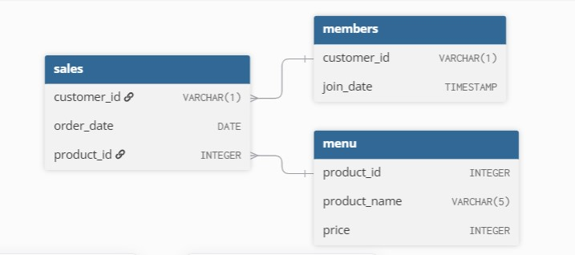

# Case Study 1: Danny's Diner

**Database:** PostgreSQL  
**Difficulty:** Beginner → Intermediate  
**Topics:** JOINs • CTEs • Window Functions • Aggregations

## Overview

Danny's Diner is a SQL case study that analyzes customer purchasing behavior using transactional restaurant data. The objective is to answer business questions related to customer spending, visit frequency, menu preferences, and the effectiveness of a customer loyalty program.

The analysis is performed using PostgreSQL and covers fundamental SQL concepts such as joins, aggregations, common table expressions (CTEs), window functions, ranking functions, and conditional logic to transform raw transactional data into actionable business insights.


## Business Problem

Danny's Diner has collected basic sales and membership data but needs help converting it into useful business insights.

The analysis focuses on understanding:

- how much each customer spends at the restaurant,
- how frequently customers visit,
- which menu items are the most popular,
- what customers purchase before and after joining the loyalty program,
- and how different loyalty-point rules affect customer rewards.

These insights can help the restaurant better understand customer behaviour, personalise the dining experience, and evaluate whether the existing loyalty program should be expanded.


## Dataset

The analysis uses three tables from the `dannys_diner` schema:

| Table | Description |
|---|---|
| `sales` | Contains individual customer purchases, including the customer ID, order date, and product ID. |
| `menu` | Contains the menu item associated with each product ID, along with its price. |
| `members` | Contains the date on which each participating customer joined the restaurant's loyalty program. |

Together, these tables make it possible to analyse customer transactions, menu preferences, spending patterns, and purchasing behaviour before and after membership.


## Entity Relationship Diagram

The diagram below shows the relationships between the `sales`, `menu`, and `members` tables.



## SQL Concepts Used

This case study demonstrates the following SQL concepts:

- INNER JOIN
- Common Table Expressions (CTEs)
- Aggregate Functions (`COUNT`, `SUM`)
- GROUP BY
- CASE Expressions
- Window Functions
- Ranking Functions (`DENSE_RANK`)
- Date Filtering
- Conditional Aggregation
- Business Rule Implementation


## Folder Structure

```text
Case-Study-1-Dannys-Diner/
├── images/
│   └── dannys-diner-erd.jpg
├── Bonus Question.md
├── Dannys Diner schema.sql
├── README.md
└── Solutions.md
```

## Project Structure

| File | Description |
|------|-------------|
| [`schema.sql`](Dannys Diner schema.sql) | Creates the schema, tables, and sample data used in the case study. |
| [`solutions.md`](solutions.md) | Contains solutions, outputs, approaches, and answers for all case-study questions. |
| [`Bonus Question.md`](Bonus Question.md) | Bonus questions |

## Key Insights

- Customer B visited the restaurant most frequently with 6 visits.
- Ramen was the most popular menu item, purchased 8 times.
- Customer A generated the highest spending ($76), followed closely by Customer B ($74).
- Customer A and B became members, allowing analysis of purchasing behaviour before and after joining.
- Loyalty point analysis showed Customer A earned 1370 points and Customer B earned 820 points by the end of January.


## Learning Outcomes

Through this case study, I strengthened my understanding of:

- Writing multi-step analytical queries using CTEs.
- Solving business problems using SQL rather than simply retrieving data.
- Applying window functions to answer ranking and sequence-based questions.
- Translating business rules into SQL using CASE expressions.
- Presenting query results in a structured and readable format suitable for business stakeholders.


## Repository Navigation

- 📄 [View Database Schema](Dannys Diner schema.sql)
- 📄 [View SQL Solutions](Solutions.md)
- 📄 [View Bonus Solutions](Bonus Question.md)
- ⬅ [Back to Main Repository](../README.md)

