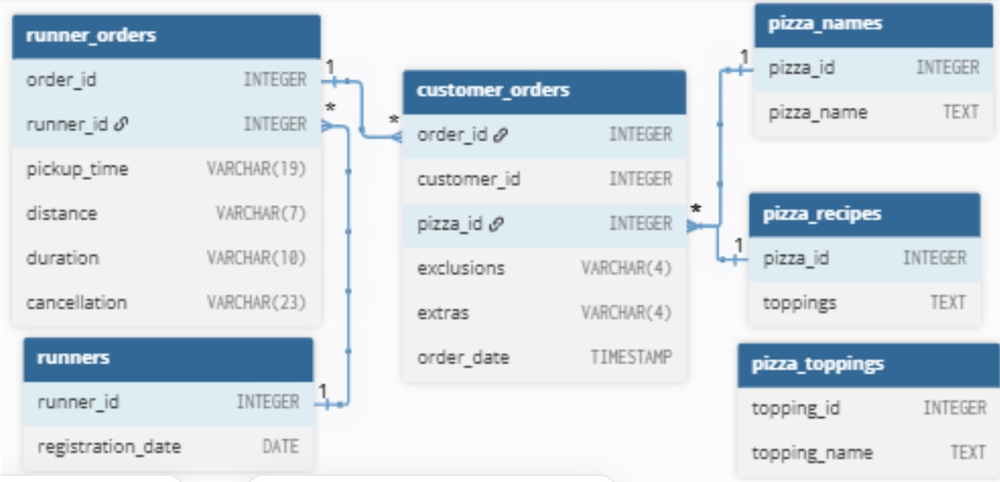

# Case Study 2: Pizza Runner

<p align="center">
  
</p>

**Database:** PostgreSQL  
**Difficulty:** Intermediate  
**Sections Covered:** Part A-E  
**Topics:** Data Cleaning • JOINs • CTEs • Window Functions • String Functions • Date & Time Functions • Aggregations

---

## Overview

Pizza Runner is a SQL case study that analyzes customer orders, runner performance, and pizza delivery operations using transactional data. The objective is to transform raw order information into meaningful business insights by evaluating customer demand, delivery efficiency, ingredient customizations, and overall business performance.

The analysis is performed using PostgreSQL and demonstrates SQL concepts including joins, common table expressions (CTEs), aggregations, window functions, data cleaning techniques, and conditional logic to solve real-world business problems.

---

## Business Problem

Pizza Runner has recently launched a pizza delivery service but stores its operational data in multiple tables with inconsistent formatting and missing values.

The analysis focuses on understanding:

- customer ordering behaviour,
- runner delivery performance,
- pizza popularity,
- ingredient customisations,
- delivery efficiency,
- and overall business performance.

Before performing the analysis, the dataset must first be cleaned and transformed to ensure accurate reporting.

---

## Dataset

The analysis uses six tables from the `pizza_runner` schema:

| Table | Description |
|--------|-------------|
| `customer_orders` | Stores customer orders, including pizza ordered, exclusions, extras and order timestamps. |
| `runner_orders` | Stores runner assignment and delivery information including pickup time, distance, duration and cancellation status. |
| `pizza_names` | Maps pizza IDs to their corresponding pizza names. |
| `pizza_recipes` | Stores the standard topping combinations for each pizza. |
| `pizza_toppings` | Maps topping IDs to topping names. |
| `runners` | Contains runner registration information. |

---

## Data Quality Observations

Before analysis, several data quality issues must be addressed:

- `pizza_recipes` stores toppings as comma-separated IDs.
- `runner_orders` contains both actual `NULL` values and text values such as `'null'`.
- `customer_orders` contains inconsistent values in the `exclusions` and `extras` columns.
- `exclusions` and `extras` store topping IDs which must be mapped using the `pizza_toppings` table.
- `order_time` is stored as a timestamp and should be preserved for time-based analysis.

---

## Entity Relationship Diagram

The following schema illustrates the relationships between all tables used in this case study.

<p align="center">
  
</p>

---

## SQL Concepts Used

This case study demonstrates the following SQL concepts:

- Data Cleaning
- Common Table Expressions (CTEs)
- INNER JOIN
- LEFT JOIN
- Aggregate Functions
- GROUP BY
- CASE Expressions
- Window Functions
- String Functions
- Date & Time Functions
- Conditional Aggregation
- Business Rule Implementation

---

## Folder Structure

```text
Case-Study-2-Pizza-Runner/
├── images/
│   ├── cover.png
│   └── erd.jpg
├── Data Cleaning.sql
├── Part_A - Pizza Metrics.md
├── Part_B - Runner and Customer Experience.md
├── Part_C - Ingredient Optimisation.md
├── Part_D - Pricing and Ratings.md
├── Part_E - Bonus Question.md
├── Pizza Runner Schema.sql
└── README.md
```

---

## Project Structure

| File | Description |
|------|-------------|
| `images/` | Contains the cover image and Entity Relationship Diagram used in the documentation. |
| [`Pizza Runner Schema.sql`](Pizza%20Runner%20Schema.sql) | Creates the schema and inserts the sample dataset. |
| [`Data Cleaning.sql`](Data%20Cleaning.sql) | Cleans inconsistent values and prepares the raw order data for analysis. |
| [`Part_A - Pizza Metrics.md`](Part_A%20-%20Pizza%20Metrics.md) | SQL solutions for Pizza Metrics questions. |
| [`Part_B - Runner and Customer Experience.md`](Part_B%20-%20Runner%20and%20Customer%20Experience.md) | SQL solutions for runner and customer analysis. |
| [`Part_C - Ingredient Optimisation.md`](Part_C%20-%20Ingredient%20Optimisation.md) | SQL solutions for ingredient optimisation. |
| [`Part_D - Pricing and Ratings.md`](Part_D%20-%20Pricing%20and%20Ratings.md) | SQL solutions for pricing and ratings analysis. |
| [`Part_E - Bonus Question.md`](Part_E%20-%20Bonus%20Question.md) | SQL solutions for bonus questions. |

---

## Key Insights

## Key Insights

- Meat Lovers was the most popular pizza, generating more customer orders than Vegetarian pizzas.
- Most deliveries were completed successfully, indicating strong overall operational performance.
- Customer pizza customisations (extras and exclusions) were common, highlighting the importance of flexible order handling.
- Delivery duration generally increased as the number of pizzas in an order increased, suggesting preparation and handling time scale with order size.
- Runner performance varied in terms of delivery time, distance travelled, and average speed, making these useful metrics for operational monitoring.
- Significant data cleaning was required before analysis because several columns contained inconsistent values, mixed data types, and non-standard representations of missing data.

---

## Learning Outcomes

Through this case study, I strengthened my understanding of:

- Cleaning inconsistent real-world datasets before analysis.
- Transforming raw operational data into business-ready datasets.
- Solving multi-step business problems using SQL.
- Working extensively with timestamps and string manipulation.
- Applying SQL to evaluate customer behaviour and operational performance.

---

## Repository Navigation

- 📄 [View Pizza Runner Schema](Pizza%20Runner%20Schema.sql)
- 🧹 [View Data Cleaning Script](Data%20Cleaning.sql)
- 📄 [View Part A - Pizza Metrics](Part_A%20-%20Pizza%20Metrics.md)
- 📄 [View Part B - Runner and Customer Experience](Part_B%20-%20Runner%20and%20Customer%20Experience.md)
- 📄 [View Part C - Ingredient Optimisation](Part_C%20-%20Ingredient%20Optimisation.md)
- 📄 [View Part D - Pricing and Ratings](Part_D%20-%20Pricing%20and%20Ratings.md)
- 📄 [View Part E - Bonus Question](Part_E%20-%20Bonus%20Question.md)