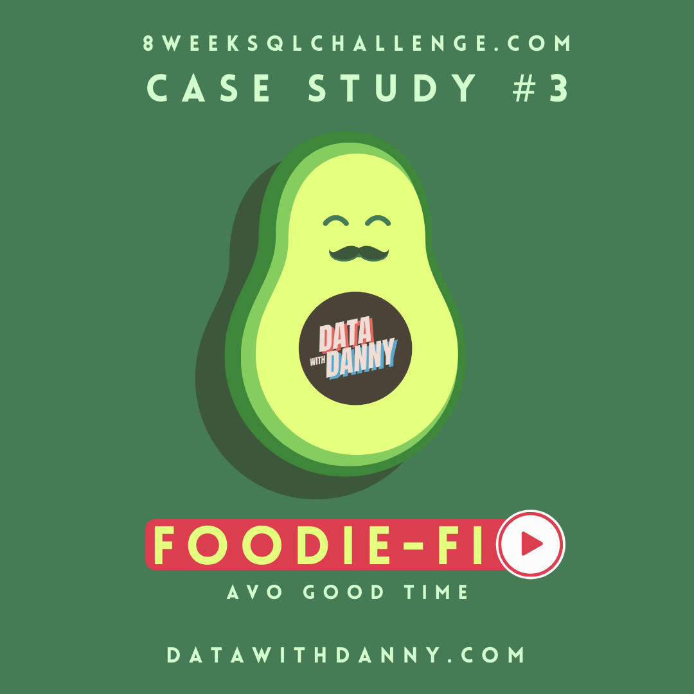

# Case Study 3: Foodie-Fi

<p align="center">
  
</p>

**Database:** PostgreSQL  
**Difficulty:** Intermediate  
**Sections Covered:** Part A-D  
**Topics:** Subscription Analytics • Customer Journey Analysis • Churn • CTEs • Window Functions • Date Functions • Payment Modelling

---

## Overview

Foodie-Fi is a subscription-based streaming platform focused on food-related video content. This case study analyses customer subscription journeys, plan transitions, churn behaviour, upgrades, downgrades, and recurring payment activity.

The analysis is performed using PostgreSQL and focuses on converting subscription event data into meaningful business insights for retention, revenue, and product decision-making.

---

## Business Problem

Foodie-Fi wants to use data to understand how customers move through its subscription plans and how those behaviours affect the business.

The analysis focuses on:

- understanding customer onboarding journeys,
- measuring customer growth and churn,
- analysing plan upgrades and downgrades,
- identifying common subscription paths,
- evaluating annual-plan adoption,
- and modelling recurring payments for 2020.

These insights can help management improve retention, pricing, and subscription strategy.

---

## Dataset

The analysis uses two source tables from the `foodie_fi` schema:

| Table | Description |
|------|-------------|
| `plans` | Contains the available subscription plans, their names, and prices. |
| `subscriptions` | Records each customer's plan changes and the date each plan became active. |

A third table, `payments`, is created as part of the challenge to model customer payments during 2020.

---

## Entity Relationship Diagram

The following schema illustrates the relationship between the subscription plans and customer subscription history.

<p align="center">
  
</p>

---

## SQL Concepts Used

This case study demonstrates the following SQL concepts:

- Common Table Expressions (CTEs)
- INNER JOIN
- Aggregate Functions
- GROUP BY
- CASE Expressions
- Window Functions
- `LAG()` and `LEAD()`
- Date Arithmetic
- Date Truncation
- Conditional Aggregation
- Customer Journey Analysis
- Churn and Retention Analysis
- Recurring Payment Modelling
- Business Rule Implementation

---

## Folder Structure

```text
Case-Study-3-Foodie-Fi/
├── images/
│   ├── cover.png
│   └── erd.png
├── Part_A - Customer Journey.md
├── Part_B - Data Analysis Questions.md
├── Part_C - Challenge Payment Question.md
├── Part_D - Outside The Box Questions.md
├── Foodie-Fi Schema.sql
└── README.md
```

---

## Project Structure

| File | Description |
|------|-------------|
| `images/` | Contains the cover image and Entity Relationship Diagram used in the documentation. |
| [`Foodie-Fi Schema.sql`](Foodie-Fi%20Schema.sql) | Creates the database schema and loads the sample dataset. |
| [`Part_A - Customer Journey.md`](Part_A%20-%20Customer%20Journey.md) | Describes the onboarding and subscription journeys of sample customers. |
| [`Part_B - Data Analysis Questions.md`](Part_B%20-%20Data%20Analysis%20Questions.md) | Contains subscription, churn, upgrade, downgrade, and plan-distribution analysis. |
| [`Part_C - Challenge Payment Question.md`](Part_C%20-%20Challenge%20Payment%20Question.md) | Builds the 2020 customer payments table using subscription billing rules. |
| [`Part_D - Outside The Box Questions.md`](Part_D%20-%20Outside%20The%20Box%20Questions.md) | Contains business recommendations and open-ended product analytics discussion. |

---

## Key Insights

- Foodie-Fi served 1,000 customers, with trial sign-ups remaining relatively consistent throughout 2020.
- March recorded the highest number of trial starts with 94 customers, while February recorded the lowest with 68.
- A total of 307 customers churned, representing 30.7% of the customer base.
- 92 customers churned immediately after completing the free trial, accounting for approximately 9% of all customers.
- Basic Monthly was the most common plan selected after the trial, chosen by 54.6% of customers, followed by Pro Monthly at 32.5%.
- As of 31 December 2020, Pro Monthly was the largest active plan segment with 326 customers.
- 195 customers upgraded to the Pro Annual plan during 2020.
- Customers took an average of approximately 105 days to upgrade from joining Foodie-Fi to the Pro Annual plan.
- Annual upgrades were most common within the first 30 days, while very few customers took more than 240 days to upgrade.
- No customers directly downgraded from Pro Monthly to Basic Monthly during 2020.

---

## Learning Outcomes

Through this case study, I strengthened my understanding of:

- Analysing customer journeys from event-based subscription data.
- Measuring churn, upgrades, downgrades, and plan transitions.
- Using window functions to compare current and previous subscription events.
- Translating billing rules into SQL logic.
- Building recurring payment schedules using date calculations.
- Connecting SQL analysis with product, retention, and revenue decisions.

---

## Repository Navigation

- 📄 [View Foodie-Fi Schema](Foodie-Fi%20Schema.sql)
- 📄 [View Part A - Customer Journey](Part_A%20-%20Customer%20Journey.md)
- 📄 [View Part B - Data Analysis Questions](Part_B%20-%20Data%20Analysis%20Questions.md)
- 📄 [View Part C - Challenge Payment Question](Part_C%20-%20Challenge%20Payment%20Question.md)
- 📄 [View Part D - Outside The Box Questions](Part_D%20-%20Outside%20The%20Box%20Questions.md)