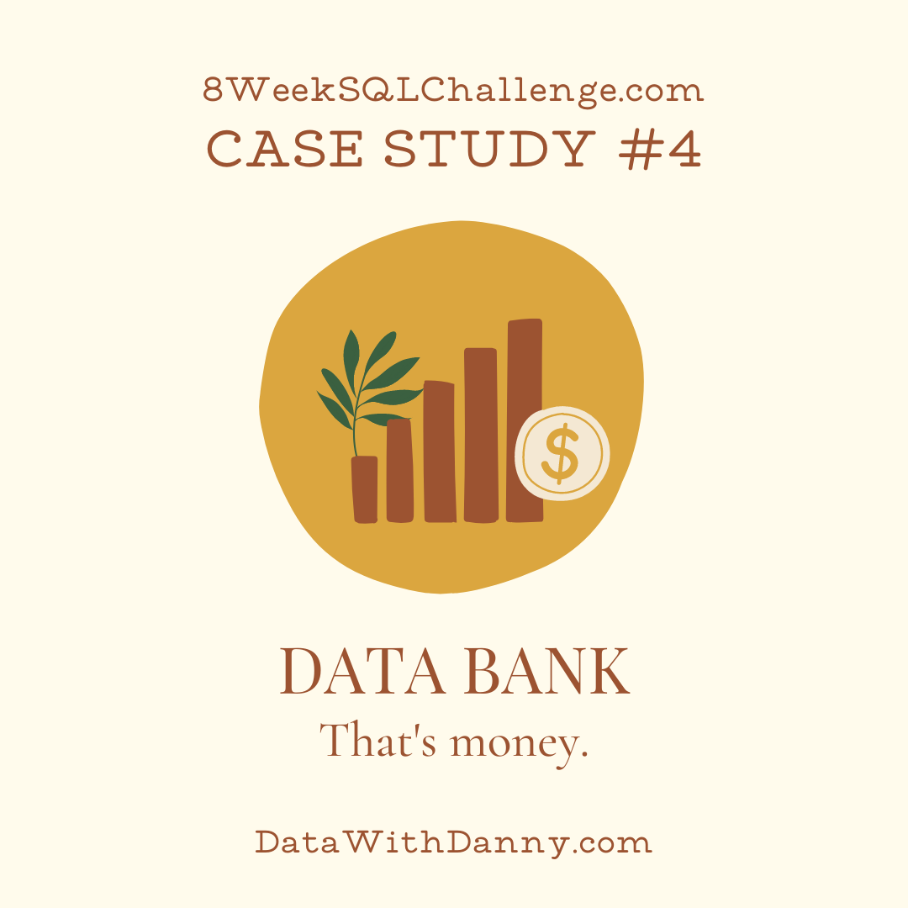
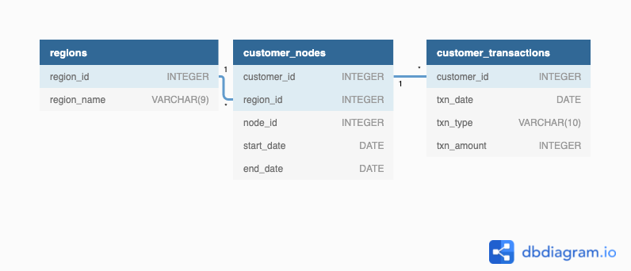

# Case Study 4: Data Bank

<p align="center">
  
</p>

**Database:** PostgreSQL  
**Difficulty:** Intermediate  
**Sections Covered:** Part A-D  
**Topics:** Banking Analytics • Customer Segmentation • Running Balances • Window Functions • Percentiles • Date Functions • Data Allocation Modelling

---

## Overview

Data Bank is a digital banking platform that combines traditional financial services with a distributed data-storage system. Customer data-storage limits are linked to the amount of money held in their accounts.

This case study analyses customer node allocations, transaction behaviour, account balances, and different data-provisioning strategies. The objective is to help Data Bank understand customer activity and estimate the amount of storage required under different allocation models.

---

## Business Problem

Data Bank wants to grow its customer base while accurately forecasting how much data storage must be provisioned for customers.

The analysis focuses on:

- exploring customer distribution across regions and nodes,
- measuring node reallocation frequency,
- analysing deposits, withdrawals, and purchases,
- calculating monthly closing balances,
- identifying customers with meaningful balance growth,
- generating running account balances,
- and comparing alternative data-allocation strategies.

These insights can support infrastructure planning, customer analysis, and future product decisions.

---

## Dataset

The analysis uses three tables from the `data_bank` schema:

| Table | Description |
|------|-------------|
| `regions` | Maps each region ID to its corresponding region name. |
| `customer_nodes` | Records the nodes and regions assigned to each customer over specific date periods. |
| `customer_transactions` | Stores customer deposits, withdrawals, purchases, transaction dates, and transaction amounts. |

---

## Entity Relationship Diagram

The following schema illustrates the relationship between customer regions, node allocations, and financial transactions.

<p align="center">
  
</p>

---

## SQL Concepts Used

This case study demonstrates the following SQL concepts:

- Common Table Expressions (CTEs)
- INNER JOIN
- Aggregate Functions
- GROUP BY
- CASE Expressions
- Window Functions
- Running Totals
- `LAG()` and `LEAD()`
- Percentile Calculations
- Date Arithmetic
- Date Truncation
- Conditional Aggregation
- Customer Balance Modelling
- Data Allocation Modelling
- Business Rule Implementation

---

## Folder Structure

```text
Case-Study-4-Data-Bank/
├── images/
│   ├── cover.png
│   └── erd.png
├── Part_A - Customer Nodes Exploration.md
├── Part_B - Customer Transactions.md
├── Part_C - Data Allocation Challenge.md
├── Part_D - Extra Challenge.md
├── Data Bank Schema.sql
└── README.md
```

---

## Project Structure

| File | Description |
|------|-------------|
| `images/` | Contains the cover image and Entity Relationship Diagram used in the documentation. |
| [`Data Bank Schema.sql`](Data%20Bank%20Schema.sql) | Creates the schema and loads the Data Bank dataset. |
| [`Part_A - Customer Nodes Exploration.md`](Part_A%20-%20Customer%20Nodes%20Exploration.md) | Contains analysis of nodes, regions, customer allocation, and reallocation periods. |
| [`Part_B - Customer Transactions.md`](Part_B%20-%20Customer%20Transactions.md) | Contains transaction-volume, deposit, withdrawal, purchase, and closing-balance analysis. |
| [`Part_C - Data Allocation Challenge.md`](Part_C%20-%20Data%20Allocation%20Challenge.md) | Models running balances and compares different storage-allocation strategies. |
| [`Part_D - Extra Challenge.md`](Part_D%20-%20Extra%20Challenge.md) | Explores interest-based data growth and optional compounding calculations. |

---

## Key Insights

- Data Bank operated across **5 regions**, with all **5 available nodes** appearing in each region.- Customer reallocation periods averaged approximately **15 days**, indicating frequent movement between infrastructure nodes.
- Deposits were the most common transaction type, accounting for the majority of customer banking activity.
- Monthly closing balances varied significantly across customers, with purchases and withdrawals causing negative balances in some cases.
- **37% of customers** increased their closing balance by more than **5%** compared with at least one previous month, highlighting differences in customer saving behaviour.
- Running account balances enabled the comparison of multiple data-allocation strategies, demonstrating how storage requirements vary depending on whether balances are calculated using month-end snapshots, average balances, or real-time balances.
- The interest-based allocation challenge showed that business rules significantly influence projected storage requirements, reinforcing the importance of clearly defined allocation policies.

---

## Learning Outcomes

Through this case study, I strengthened my understanding of:

- Analysing banking-style transaction datasets.
- Calculating running balances using window functions.
- Measuring customer distribution across regions and infrastructure nodes.
- Using percentiles to evaluate customer reallocation behaviour.
- Calculating monthly closing balances and account growth.
- Translating financial business rules into SQL.
- Comparing alternative data-provisioning strategies.
- Applying SQL to infrastructure and capacity-planning problems.

---

## Repository Navigation

- 📄 [View Data Bank Schema](Data%20Bank%20Schema.sql)
- 📄 [View Part A - Customer Nodes Exploration](Part_A%20-%20Customer%20Nodes%20Exploration.md)
- 📄 [View Part B - Customer Transactions](Part_B%20-%20Customer%20Transactions.md)
- 📄 [View Part C - Data Allocation Challenge](Part_C%20-%20Data%20Allocation%20Challenge.md)
- 📄 [View Part D - Extra Challenge](Part_D%20-%20Extra%20Challenge.md)
- ⬅️ [Back to Main Repository](../README.md)